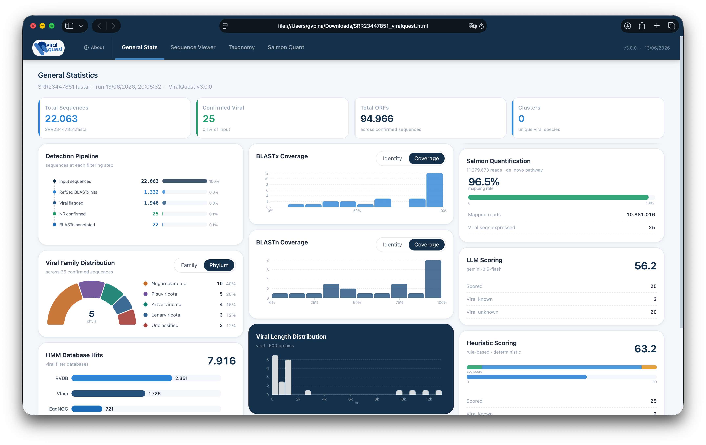
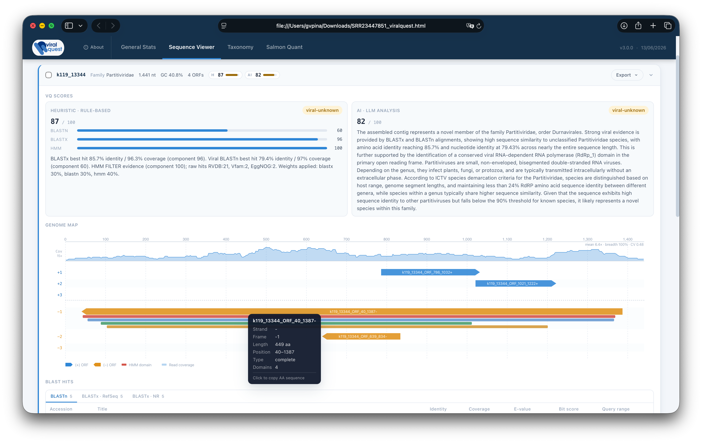

<div align="center">
  
  <br><br>
  <strong>A pipeline for viral diversity analysis from assembled contigs</strong>
  <br><br>
  
  
  
  
</div>

---

> **BETA / TEST VERSION** — This is a development release. APIs, arguments, and output formats may change without notice. Not recommended for production use.

## Overview

ViralQuest v3 detects and characterizes viral sequences from assembled metagenomics or transcriptomics contigs. The pipeline integrates:

- **Diamond BLASTx** against a curated viral RefSeq database (filter) and NCBI NR (confirmation)
- **HMM profiling** with RVDB, Vfam, and EggNOG (viral detection) + Pfam (functional annotation)
- **BLASTn** — local database or online via NCBI qblast; online mode captures accession and query coordinates
- **Taxonomy annotation** from NCBI viral taxonomy + ICTV
- **Sequence clustering** by species
- **Salmon quantification** with reference or de-novo pathway and bundled multi-kingdom housekeeping genes
- **LLM scoring** via Ollama (local) or OpenAI / Anthropic / Google APIs (`google-genai`)
- **Self-contained HTML report** with interactive genome map (ORF frames + HMM domains), cluster analysis, taxonomy tree, BLAST tables, and Salmon plots

Paper: [https://link.springer.com/article/10.1186/s12859-026-06391-6](https://link.springer.com/article/10.1186/s12859-026-06391-6)

---

## Installation

### 1. Create a conda environment

Create a new conda environment to manage all required packages.

```bash
conda create -n viralquest python
```

After create the new env, use `conda activate viralquest` to run the next steps.

### 2. Clone the repository and install the environment

```bash
git clone https://github.com/gabrielvpina/viralquest.git
cd viralquest
git checkout total-refactor
pip install -e .
```

`pip install -e .` installs the Python package and registers the CLI entry points.

### 3. Install dependencies and databases

```bash
viralquest-setup
```

`viralquest-setup` performs the full first-time setup in a single command:

1. Verifies that pixi is available; installs it automatically if not.
2. Runs `pixi install` if the environment is not yet built.
3. Downloads reference databases from Zenodo into `data/` (HMM profiles: RVDB, Vfam, EggNOG, Pfam; viral Diamond filter DB).

To update or re-download databases **independently**:

```bash
viralquest-download           # skips files already present
viralquest-download --force   # re-downloads all files
```

---

## External databases (user-provided)

These are optional but required for full pipeline runs.

| Database | Purpose | Approx. size |
|---|---|---|
| `nr.dmnd` | Diamond BLASTx NR confirmation | ~346 GB |
| BLAST `nt` | BLASTn local search | ~1 TB |

Build NR Diamond database:

```bash
wget https://ftp.ncbi.nlm.nih.gov/blast/db/FASTA/nr.gz
gunzip nr.gz
diamond makedb --in nr --db nr.dmnd
```

BLASTn can also run online (`--blastn-online`); the NR step is optional.

---

## Usage

Minimal run:

```bash
viralquest \
  -in   SAMPLE.fasta \
  -out  SAMPLE_output \
  -cpu  8
```

Full run with NR, local BLASTn, Salmon, and local LLM:

```bash
viralquest \
  -in            SAMPLE.fasta \
  -out           SAMPLE_output \
  -nr            /path/to/nr.dmnd \
  -n             /path/to/nt \
  --transcriptome host_transcriptome.fasta \
  --reads         R1.fastq R2.fastq \
  --hk-genes      housekeeping_ids.txt \
  --model-type    ollama \
  --model-name    qwen3:4b \
  --llm-tokens    low \
  -cpu            8 \
  --live
```

### Arguments

#### Required

| Argument | Description |
|---|---|
| `-in` | Input FASTA (assembled contigs) |
| `-out` | Output directory (created if absent) |

#### Pipeline tuning

| Argument | Description |
|---|---|
| `-cpu` | CPU threads for Diamond, HMMsearch, BLASTn, and Salmon (default: 2) |
| `--cap3` | Run CAP3 assembly before the pipeline |
| `--min-identity` | Clustering identity threshold (default: 70%) |
| `--force` | Export all sequences, ignoring viral confirmation filters |

#### Databases

| Argument | Description |
|---|---|
| `-nr` / `--nr-db` | Diamond-format NR database (optional) |
| `--nr-block-size` | GB of RAM per Diamond database pass (default: Diamond built-in ~2.0) |
| `--nr-index-chunks` | Diamond seed-index chunks; lower = fewer disk passes, higher RAM (default: 4) |
| `--nr-tmpdir` | Directory for Diamond temporary files (e.g. `/dev/shm` for RAM disk) |
| `--db-dir` | Flat directory containing all five binary database files; overrides the bundled `data/` layout |

#### BLASTn (choose one)

| Argument | Description |
|---|---|
| `-n` / `--blastn-local` | Path to a local BLAST nucleotide database |
| `--blastn-online` | NCBI e-mail for qblast (no local DB required); captures accession and query coordinates |
| `--blastn-online-db` | NCBI database for online BLASTn (default: `nt`) |

#### Salmon quantification

| Argument | Description |
|---|---|
| `--reads` | FASTQ file(s): one = single-end, two = paired-end |
| `--read-type` | Read technology, required with `--reads`: `sr` (Illumina), `ont` (Nanopore), `pb` (PacBio CLR), `hifi` (PacBio HiFi). Salmon quantification runs for `sr` only; with `ont`/`pb`/`hifi` the Salmon step is skipped (its short-read mapping is invalid for long reads) and only minimap2 read coverage is produced. |
| `--transcriptome` | Host transcriptome FASTA; enables reference pathway |
| `--hk-genes` | Text file of reference housekeeping gene IDs (one per line) for normalization; requires `--transcriptome` |

#### LLM scoring

| Argument | Description |
|---|---|
| `--model-type` | Provider: `ollama`, `openai`, `anthropic`, `google` |
| `--model-name` | Model identifier (e.g. `qwen3:4b`, `gpt-4o`, `gemini-2.5-pro`) |
| `--llm-tokens` | Prompt mode: `high` (all hits, full details) or `low` (best hits only, compact) |
| `--api-key` | API key for cloud providers (not required for Ollama) |

#### Output / misc

| Argument | Description |
|---|---|
| `--live` | Rich Live display: ASCII banner + scrolling log box + step progress bar |
| `-v` / `--version` | Print version and exit |
| `-h` / `--help` | Show formatted help and exit |

---

## Output

```
SAMPLE_output/
├── diamond/
│   ├── refseq.tsv               # Diamond BLASTx vs viral RefSeq filter
│   └── nr.tsv                   # Diamond BLASTx vs NR (if --nr-db provided)
├── hmm/
│   ├── RVDB.tsv
│   ├── Vfam.tsv
│   ├── EggNOG.tsv
│   └── Pfam.tsv
├── blastn/
│   └── blastn.tsv               # BLASTn hits (local or online)
├── salmon/                      # Salmon output directory (if --reads provided)
│   └── vq_quant/quant.sf
├── SAMPLE_viral_contigs.fasta   # confirmed viral sequences
├── SAMPLE_viralquest.json       # full structured report (JSON)
├── SAMPLE_viralquest.html       # self-contained interactive HTML report
└── viralquest.log               # full pipeline log
```

The HTML report is fully self-contained (single file, no external dependencies) and includes:

- **Statistics dashboard** — pipeline summary, BLAST/HMM counts, LLM score distribution
- **Cluster analysis** — sequence grouping with representative sequences and member alignment stats
- **Sequence viewer** — per-sequence genome map with lane-packed ORF frames (+1/+2/+3/−1/−2/−3), HMM domain overlays, tabbed BLAST hit tables (BLASTn / BLASTx-RefSeq / BLASTx-NR), LLM analysis text, and FASTA export
- **Taxonomy tree** — D3 radial tree built from phylum → order → family → genus → sequence
- **Salmon quantification** — viral expression boxplots grouped by cluster, housekeeping gene bar charts per kingdom, host–viral similarity table (EVE detection)

### Screenshots






---

## Salmon quantification

Two pathways are available depending on whether a reference transcriptome is provided.

**Reference pathway** (`--transcriptome` + `--reads`): builds a combined Salmon index from viral sequences + bundled multi-kingdom housekeeping genes + user transcriptome. BLASTn of the transcriptome against viral sequences detects potential endogenous viral elements (EVEs).

**De-novo pathway** (`--reads` only): BLASTn of bundled housekeeping genes against the assembled contigs identifies normalization anchors; the full contig set is quantified directly.

Bundled housekeeping genes cover seven kingdoms: mammals, arthropods, plants, fish, fungi, bacteria, and nematodes.

---

## LLM scoring

Runs only on NR-confirmed sequences. The Google backend uses the [`google-genai`](https://googleapis.github.io/python-genai/) package (`google-genai>=1.0.0`).

```bash
# Local (Ollama) — minimum recommended model: qwen3:4b
--model-type ollama --model-name qwen3:4b --llm-tokens low

# Cloud API
--model-type google  --model-name gemini-2.5-flash --api-key YOUR_KEY --llm-tokens low
--model-type openai  --model-name gpt-4o           --api-key YOUR_KEY --llm-tokens high
--model-type anthropic --model-name claude-sonnet-4-6 --api-key YOUR_KEY --llm-tokens high
```

Output per sequence: `vq_score` (0–100), `classification` (`viral-known` / `viral-unknown` / `non-viral`), and a free-text analysis paragraph.

Setup guide: [wiki/Setup-AI-Summary-resource](https://github.com/gabrielvpina/viralquest/wiki/Setup-AI-Summary-resource)
